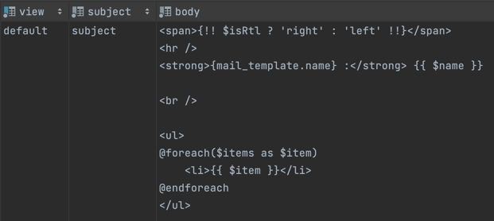
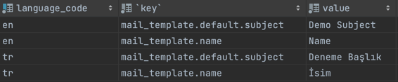

```
composer require fatihirday/mail-template
```

```
 php artisan vendor:publish --provider="Fatihirday\MailTemplate\MailTemplateServiceProvider"
```

<br />

#### MailTemplate


<br />

#### MailLanguage



<br />

---

`ExampleMail.php`

```[PHP]
<?php 

class ExampleMail extends Mailable
{
    use Queueable;
    use SerializesModels;
    use MailViewTemplate;

    /**
     * Create a new message instance.
     *
     * @return void
     */
    public function __construct(
        protected readonly string $languageCode = 'en',
        protected readonly array $data = []
    )
    {
        //
    }

    /**
     * Build the message.
     *
     * @return $this
     */
    public function build()
    {
        return $this->builder('default',  $this->languageCode);
    }
}
```


### Sender
```
$data = [
    'name' => 'fatih',
    'items' => ['a', 'b', 'c']
];

return Mail::to('fatihirday@gmail.com')
    ->send(new ExampleMail('tr', $data));
```
